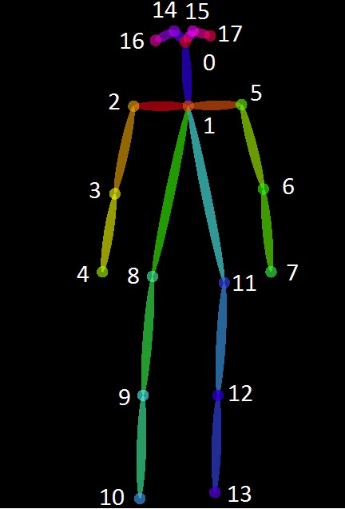

# Human pose estimation with YoloV7

Unlike conventional Pose Estimation algorithms, YOLOv7 pose is a single-stage multi-person keypoint detector. It is similar to the bottom-up approach but heatmap free. It is an extension of the one-shot pose detector – YOLO-Pose. It has the best of both Top-down and Bottom-up approaches.

YOLOv7 Pose is trained on the COCO dataset which has 17 landmark topologies.
It is implemented in PyTorch making the code super easy to customize as per your need.

